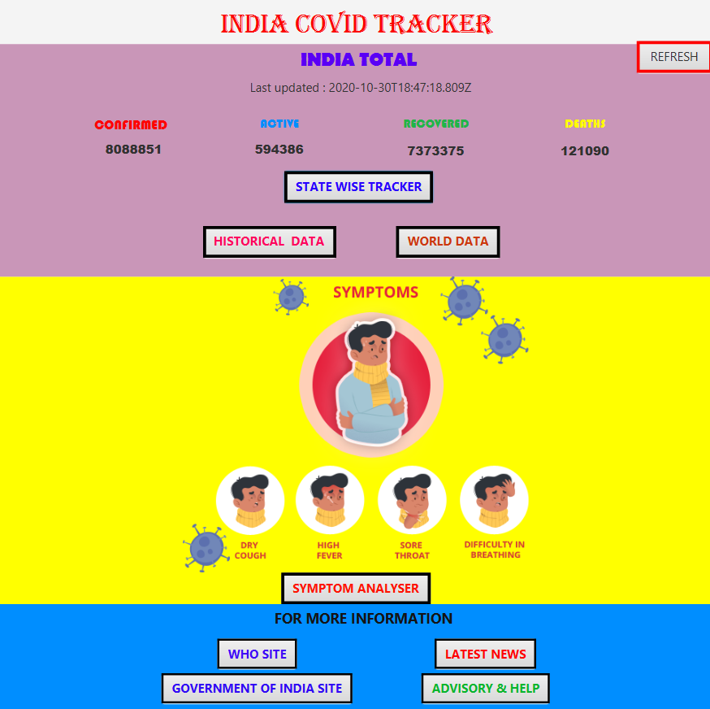
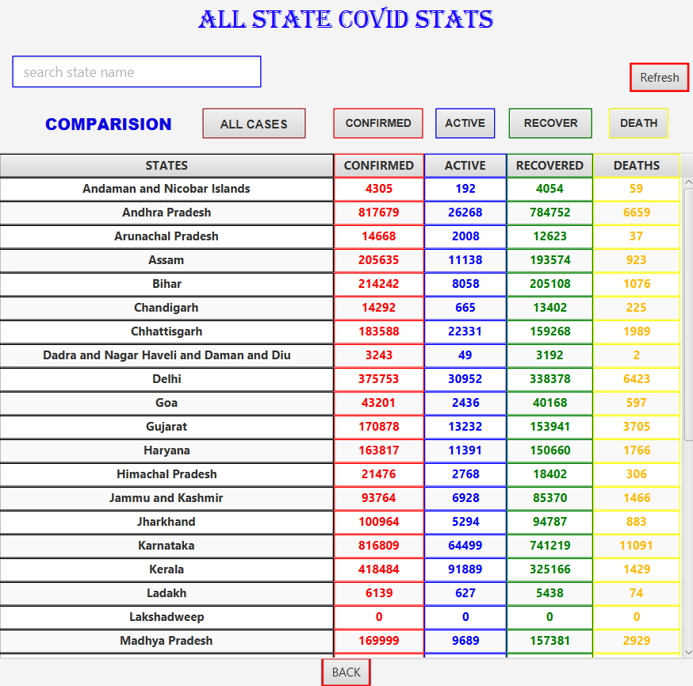
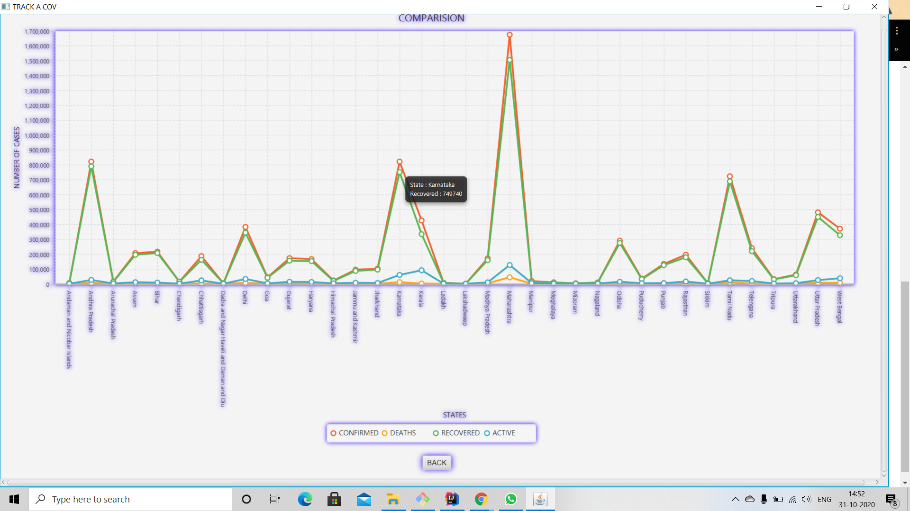

# TRACK A COV (Team - BOOGY DEVS)
## Boogy-Covid is a Covid Tracker Desktop Application.
* It provides latest Covid Data of India & World.
* It provides historical Covid Data of India and its all States.
* It shows Comparision Graph of Covid Data.
* It helps in analysing your self against Covid Symptoms. 
* It provides latest Covid News.  
* It shows basic Advisory about Covid & connects to official WHO & GOV of India Websites.

### Boogy-Covid Application
#### Starting Application ...  we get following window ->

In above window , we get latest Covid Stats of India. 

#### After clicking "State Wise Tracker" Button , we get following window ->

In above Window , we get latest Covid Stats of each States.
We can search Covid Stats of individual State.
We can lookup at different Comparision Charts.
 
