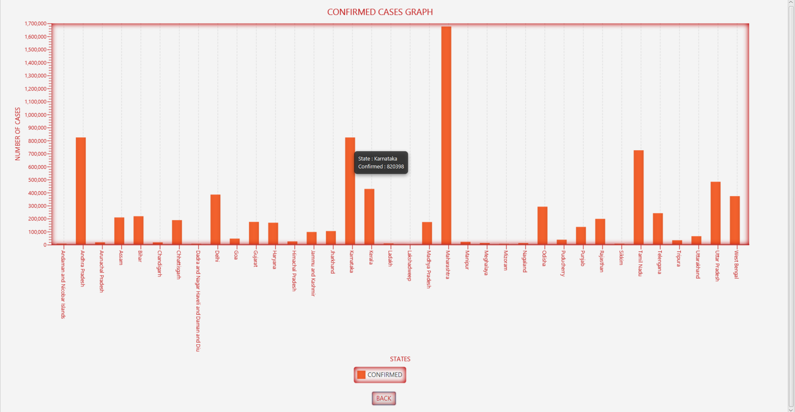
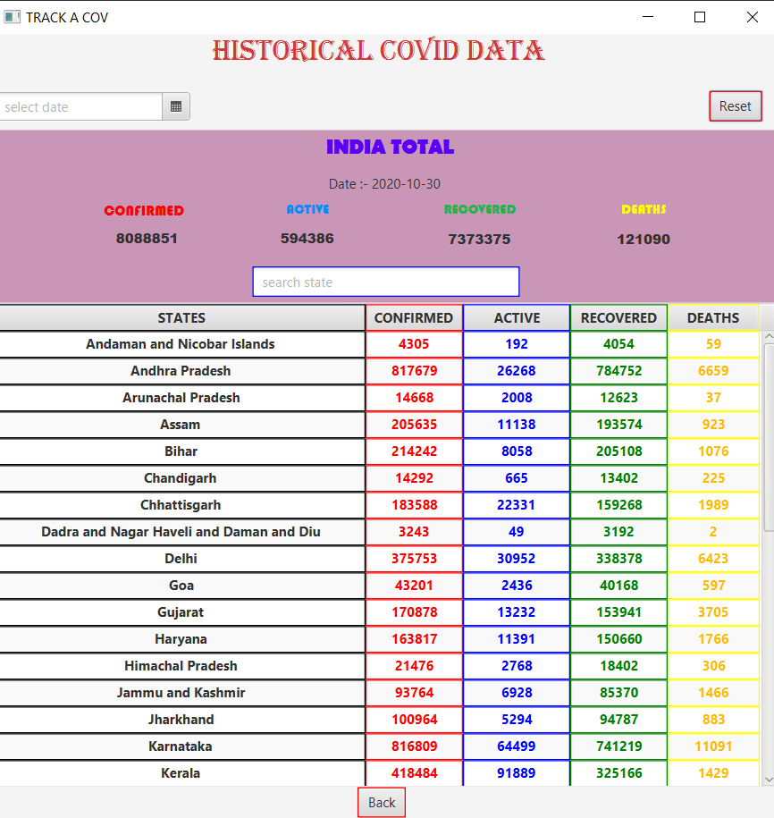
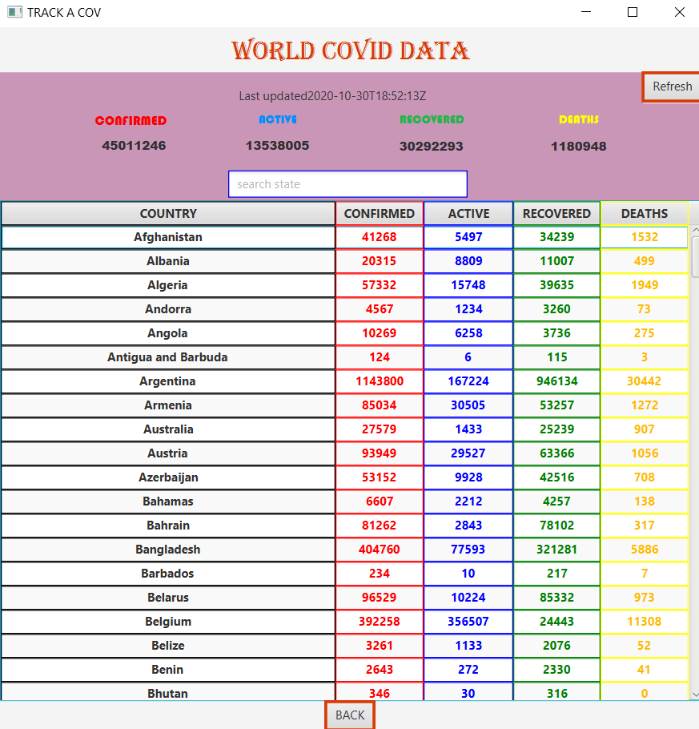
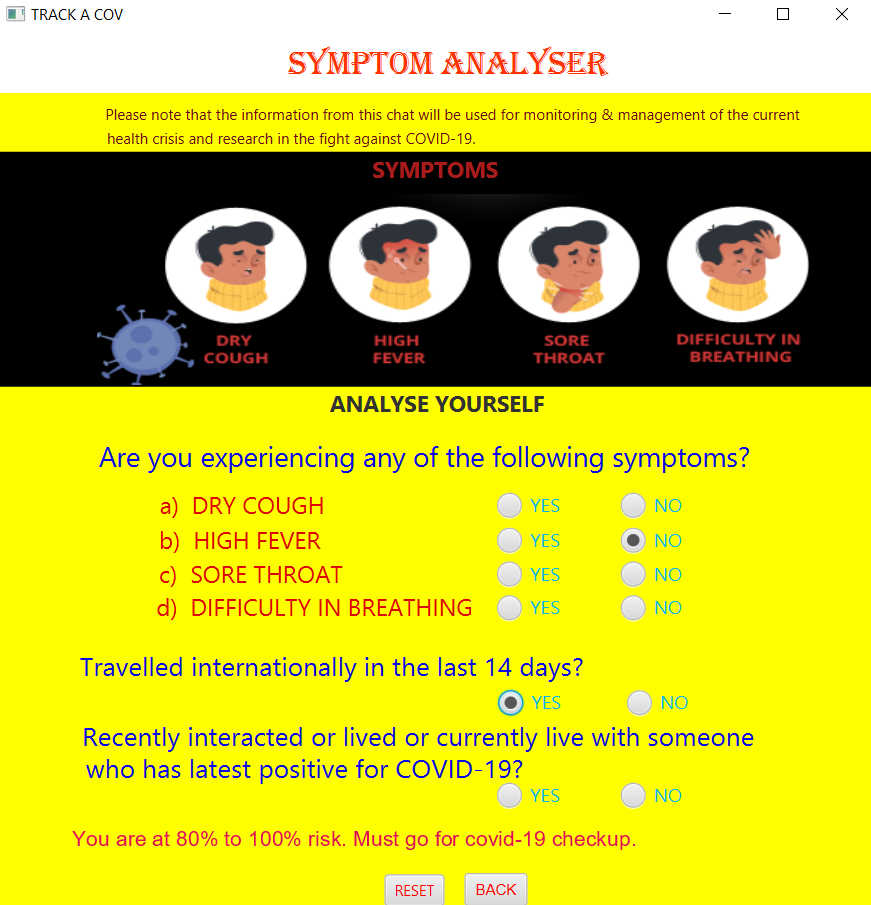
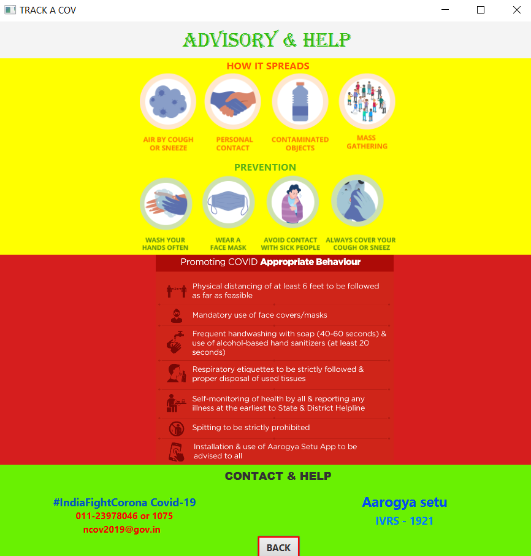

# TRACK A COV (Team - BOOGY DEVS)
## Boogy-Covid is a Covid Tracker Desktop Application.
* It provides latest Covid Data of India & World.
* It provides historical Covid Data of India and its all States.
* It shows Comparision Graph of Covid Data.
* It helps in analysing yourself against Covid Symptoms. 
* It provides latest Covid News.  
* It shows basic Advisory about Covid & connects to official WHO & GOV of India Websites.

### Boogy-Covid Application
#### Starting Application ...  we get following window ->

In above window :

* We get latest Covid Stats of India. 

#### After clicking "State Wise Tracker" Button , we get following window ->

In above Window :

* We get latest Covid Stats of each State.
* We can search Covid Stats of individual State.
* We can lookup at different Comparision Charts.

  

In above window :

* We can get data of individual Bar by placing cursor.

#### After clicking "Historical Data" Button , we get following window ->

 
In above Window :

* We can search Covid Stats of different dates.

#### After clicking "World Data" Button , we get following window ->

In above Window :

* We get latest Covid Stats of each Country.
* We can search Covid Stats of individual Country.

#### After clicking "Symptom Analyser" Button , we get following window ->

In above Window :

* We can analyse our symptom.

#### After clicking "Advisory & Help" Button , we get following window ->

